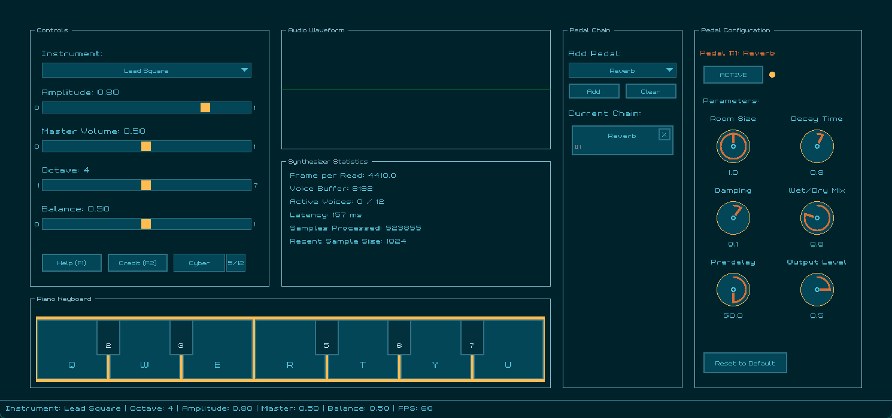

# QSynth


A high-performance multi-layered audio synthesizer written in C, featuring real-time audio processing with advanced instrument design capabilities.

## Features

- **Multi-layered synthesis** - Up to 4 tone layers per instrument with independent waveforms and detuning
- **Real-time audio processing** - Low-latency audio output with configurable buffer sizes  
- **Custom Instruments** - Create custom instruments by defining synthesis parameters
- **Cross-platform** - Windows and Linux support
- **Polyphonic playback** - Up to infinite simultaneous voices with independent panning and velocity

## Quick Start

### Building

1. **Build the build system:**
   ```bash
   gcc build.c -o nob
   ```

2. **Build examples:**
   ```bash
   # Build basic synthesizer example
   ./nob basic_synth
   
   # Build instruments test
   ./nob instruments_test
   
   # Build for 64-bit
   ./nob basic_synth --x64
   
   # Build with debug symbols
   ./nob basic_synth --debug
   ```

3. **Run:**
   ```bash
   cd build
   ./basic_synth.exe
   ```

### Basic Usage

```c
#include "qsynth.h"

int main() {
    Synthesizer *synth;
    
    // Initialize synthesizer
    if (!synth_init(&synth, 44100.0, 2)) {
        printf("Failed to initialize synthesizer\n");
        return 1;
    }
    
    // Start audio playback
    synth_start(synth);
    
    // Play a note with duration control
    NoteCfg note = {
        .midi_note = 60,        // Middle C
        .duration_ms = 1000,    // 1 second
        .amplitude = 0.8,       // 80% volume
        .velocity = 1.0,        // Full velocity
        .pan = 0.5              // Center pan
    };
    
    synth_play_note(synth, INST_WARM_BASS, NOTE_CONTROL_DURATION, &note);
    
    // Or play with manual control
    int voice_id = synth_play_note(synth, INST_LEAD_SQUARE, NOTE_CONTROL_MANUAL, &note);
    Sleep(2000);  // Hold note for 2 seconds
    synth_end_note(synth, voice_id);  // Release note
    
    // Cleanup
    synth_stop(synth);
    synth_cleanup(synth);
    
    return 0;
}
```

## Note Control Modes

QSynth supports two ways to control note duration:

### Duration Control
Notes automatically stop after a specified time:
```c
NoteCfg note = {.midi_note = 60, .duration_ms = 1000, ...};
synth_play_note(synth, INST_WARM_BASS, NOTE_CONTROL_DURATION, &note);
```

### Manual Control
You control when notes start and stop (like holding a piano key):
```c
NoteCfg note = {.midi_note = 60, ...};
int voice_id = synth_play_note(synth, INST_LEAD_SQUARE, NOTE_CONTROL_MANUAL, &note);
// ... note plays indefinitely until you call:
synth_end_note(synth, voice_id);
```

## Creating Custom Instruments

### Step 1: Add Instrument Type

Add your new instrument to the enum in `assets/instruments.h`:

```c
typedef enum {
    INST_LEAD_SQUARE = 0,
    INST_WARM_BASS,
    INST_ETHEREAL_PAD,
    INST_METALLIC_PLUCK,
    INST_WOBBLE_BASS,
    INST_BELL_LEAD,
    INST_DEEP_DRONE,
    INST_MY_CUSTOM_SYNTH,    // <- Add your instrument here
    
    INST_COUNT  // total number of instruments
} InstrumentType;
```

### Step 2: Define Instrument Parameters

Add the instrument definition in `src/assets/instruments.c`:

```c
[INST_MY_CUSTOM_SYNTH] = {
    .tone = {
        .layers = {
            {.type = WAVE_SQUARE},      // Layer 1: Square wave
            {.type = WAVE_SAWTOOTH},    // Layer 2: Sawtooth
            {.type = WAVE_SINE},        // Layer 3: Sine wave
            {.type = WAVE_TRIANGLE},    // Layer 4: Triangle
        },
        .detune = {0.0, 0.05, -12.0, 24.0},     // Detune in semitones
        .mix_levels = {0.6, 0.3, 0.2, 0.1},    // Volume mix for each layer
        .phase_diff = {0, 90, 180, 270},        // Phase offset in degrees
        .filter_opt = {
            .cutoff = 1200,                     // Filter cutoff frequency
            .filter_type = FILTER_LOWPASS,      // Filter type
            .resonance = 0.4                    // Filter resonance
        },
        .envelope_opt = ENVELOPE_OPT_PLUCK,     // Envelope preset
    },
    .name = "My Custom Synth",
    .category = "Custom",
    .description = "A custom synthesizer with rich harmonic content"
},
```

### Instrument Parameters

- **Layers**: Mix up to 4 waveforms (SINE, SQUARE, SAWTOOTH, TRIANGLE)
- **Detune**: Pitch offset in semitones (0.05 = slight chorus, 12 = octave up)
- **Mix Levels**: Volume for each layer (0.0 to 1.0)
- **Phase Differences**: Phase offset in degrees (0-360)
- **Filters**: LOWPASS, HIGHPASS, BANDPASS, or NONE
- **Envelopes**: PLUCK, PAD, BASS, LEAD, PERCUSSION, ORGAN presets

## API Reference

### Core Functions

```c
// Initialization
bool synth_init(Synthesizer** synth_ptr, double sample_rate, int channels);
void synth_cleanup(Synthesizer* synth);

// Audio control
bool synth_start(Synthesizer* synth);
void synth_stop(Synthesizer* synth);

// Sound generation
int synth_play_note(Synthesizer* synth, InstrumentType instrument, 
                    NoteControlMode control_mode, NoteCfg *cfg);
void synth_end_note(Synthesizer* synth, int voice_id);

// Configuration
int synth_set_master_volume(Synthesizer *synth, double volume);

// Error handling
QSynthError synth_get_last_error();
const char* synth_get_error_string(QSynthError error);
```

### Note Configuration

```c
typedef struct {
    int midi_note;      // MIDI note number (60 = middle C)
    int duration_ms;    // Duration in milliseconds (for DURATION mode)
    double amplitude;   // Note volume (0.0 to 1.0)
    double velocity;    // Attack velocity (0.0 to 1.0)
    double pan;         // Stereo panning (0.0 = left, 0.5 = center, 1.0 = right)
} NoteCfg;
```

## Available Instruments

- `INST_LEAD_SQUARE` - Square wave lead synthesizer
- `INST_WARM_BASS` - Warm bass sound
- `INST_ETHEREAL_PAD` - Atmospheric pad
- `INST_METALLIC_PLUCK` - Plucked metallic sound
- `INST_WOBBLE_BASS` - Bass with filter modulation
- `INST_BELL_LEAD` - Bell-like lead sound
- `INST_DEEP_DRONE` - Deep drone sound

## Build Options

- `--debug` - Build with debug symbols and logging
- `--x64` - Build for 64-bit architecture
- `--release` - Build with optimizations

## Requirements

- **Windows**: MinGW-w64 or Visual Studio
- **Linux**: GCC with pthread support